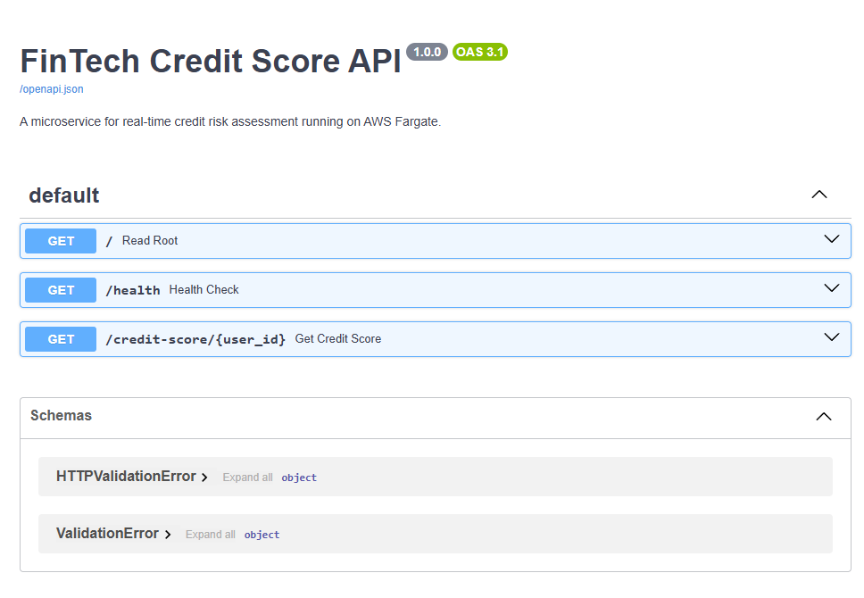
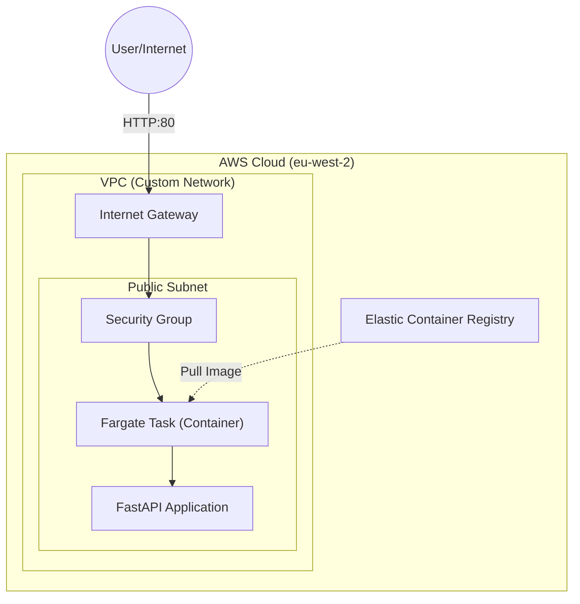

# 🏦 FinTech Credit Score API - Serverless Fargate Architecture


A production-ready, containerized microservice architecture deployed on **AWS ECS Fargate** using **Infrastructure as Code (IaC)**.



---

## ⚡ Tech Stack Overview

| Layer | Technology | Description |
| :--- | :--- | :--- |
| **Compute** | **AWS Fargate** | Serverless container engine (NoOps). |
| **Orchestration**| **Amazon ECS** | Managing container lifecycle and scaling. |
| **IaC** | **Terraform** | Modular infrastructure definition (VPC, IAM, ECS). |
| **Network** | **AWS VPC** | Custom isolated network with Public Subnets. |
| **Registry** | **AWS ECR** | Secure Docker image storage with vulnerability scanning. |
| **App** | **FastAPI** | High-performance Python framework. |

---

## 🎯 Business Value & Goal
The goal of this project is to demonstrate a **"Serverless-First" approach** to container orchestration. By leveraging AWS Fargate, we eliminate the operational overhead of managing EC2 instances while maintaining the portability of Docker.

This architecture is designed for:
* **Scalability:** ECS handles automatic task placement and recovery (Self-Healing).
* **Cost Efficiency:** "Scale-to-zero" capabilities (pay only for running time).
* **Reproducibility:** 100% of the infrastructure is defined in Terraform.

---

## 🏗️ Technical Architecture

The application logic is a lightweight mock/simulation used to demonstrate the underlying infrastructure capabilities. The primary focus of this repository is the Secure Cloud Architecture (VPC, IAM, Fargate), not the business logic itself.


---

## ⚖️ Architectural Trade-offs (FinOps & Design)

As a Cloud Architect, every decision involves a trade-off between Performance, Security, and Cost. For this specific demo, the following strategic choices were made:

---

### 1. Direct Public Access vs Load Balancer (ALB)

**Decision:** The Fargate Task is exposed via a Public IP, omitting the Application Load Balancer (ALB).

**Why:** An ALB incurs a fixed hourly cost (~$20/month) regardless of traffic.

**Justification:**

For a portfolio/demo environment, prioritizing **Cost Optimization** was the logical choice.  
In a production banking environment:

- Tasks would be placed in a **Private Subnet**
- Traffic would flow through an **ALB + AWS WAF**
- SSL termination, DDoS protection, and throttling would be enforced

---

### 2. Fargate vs EC2

**Decision:** Used Fargate launch type instead of ECS on EC2.

**Why:** Eliminates the "undifferentiated heavy lifting" of OS patching & instance management.

**Justification:**  
While EC2 Reserved Instances may be cheaper for constant workloads, **Fargate offers superior ROI** for microservices requiring low operational maintenance (**NoOps**).

---

### 3. Monolithic Terraform File

**Decision:** Infrastructure defined in a consolidated fargate.tf file.

**Why:** To improve readability for educational/review purposes, allowing the full logical flow to be understood in a single view without context switching.

---

## 💰 Cloud Cost Estimate (Monthly)

Based on AWS **eu-west-2** pricing (approximate):

| Service        | Unit        | Estimated Cost |
|----------------|-------------|----------------|
| **Fargate vCPU** | 0.25 vCPU   | ~$7.00         |
| **Fargate RAM**  | 0.5 GB      | ~$1.50         |
| **ECR Storage**  | 100 MB      | ~$0.01         |
| **VPC / IGW**     | Free Tier   | $0.00          |

---

### **TOTAL: ~\$8.50 / month**

> **Note:** Using *Fargate Spot* could reduce compute costs by up to **70%**.


---

## 🚀 How to Deploy

This project follows a **GitOps-style workflow**.

---

### ✅ Prerequisites

Ensure the following tools are installed:

- AWS CLI configured  
- Terraform  
- Docker Desktop  

---

### 🧱 Step 1: Infrastructure Provisioning

Initialize and apply the Terraform configuration to create:

- VPC  
- IAM Roles  
- ECR Repository  
- ECS Cluster  
- Fargate Service  

```bash
cd terraform
terraform init
terraform apply
# Type 'yes' to confirm
```
---

### 🛠️ Step 2: Build & Push the Docker Image

Once Terraform completes, it outputs the `ecr_repository_url`.

#### 1. Login to ECR (eu-west-2 = London)

```bash
aws ecr get-login-password --region eu-west-2 | docker login --username AWS --password-stdin <YOUR_ECR_URL>
```
#### 2. Build, Tag, and Push Image

```bash
docker build -t fintech-api .
docker tag fintech-api:latest <YOUR_ECR_URL>:latest
docker push <YOUR_ECR_URL>:latest
```

---

### 🚀 Step 3: Auto-Deployment
ECS Fargate will automatically detect the new image in ECR.
You can also force a new deployment via the AWS Console.

Then visit:

```arduino

http://<PUBLIC-IP>/docs
to access the interactive FastAPI Swagger UI.
```
---

## 🛡️ Security Measures Implemented

- **Least Privilege:** IAM roles scoped strictly to ECR pull + CloudWatch logs.
- **Network Isolation:** Custom VPC instead of AWS default VPC.
- **Image Scanning:** ECR vulnerability scanning enabled on push.
- **Minimal Base Image:** `python:3.9-slim` used to reduce attack surface.

---

## 👤 Author

**Kevin Della Piazza**  
Cloud Solutions Architect & AI Engineer
